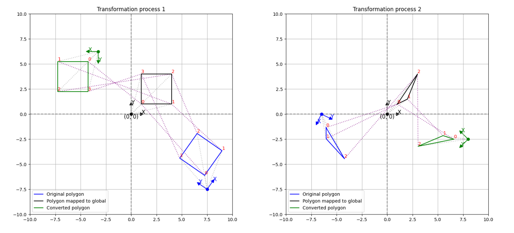

<h3>Simple implementation of Plane2d</h3>

The `Plane2d` class has properties that are the origin, x-axis, and y-axis as the 2D coordinate system. In this class that I implemented, the core functions are as follows:

- _get_local_coords_matrix(): This method constructs a matrix that represents the local coordinate system of the plane in terms of [homogeneous coordinates](https://eunho5751.tistory.com/38)
- get_converted_geometry_by_plane(): Converts a geometry from the plane's coordinate system to another

<br>



```python
class Plane2d(AxesVisualizer):
    def __init__(self, origin: np.ndarray, x_axis: np.ndarray, y_axis: np.ndarray, normalize: bool = True):
        self._origin = origin
        self._x_axis = x_axis / np.linalg.norm(x_axis) if normalize else x_axis
        self._y_axis = y_axis / np.linalg.norm(y_axis) if normalize else y_axis
        

    def _get_local_coords_matrix(self) -> np.ndarray:
        """Returns a local coordinate matrix expressed in homogeneous coordinates

        Returns:
            np.ndarray: local coordinates of self
        """
        
        return np.array(
            [
                [self.x_axis[0], self.y_axis[0], self.origin[0]],
                [self.x_axis[1], self.y_axis[1], self.origin[1]],
                [0, 0, 1],
            ]
        )
    
    def get_converted_geometry_by_plane(self, plane_to_convert: Plane2d, geometry_to_convert: GeometryCollection) -> GeometryCollection:
        """Converts a given geometry from one plane to another

        Args:
            plane_to_convert (Plane2d): Target plane to convert the coordinate system
            geometry_to_convert (GeometryCollection): Geometry of Shapely to convert

        Returns:
            GeometryCollection: Converted geometry
        """
        
        matrix_to_map_global_coords = np.linalg.inv(self._get_local_coords_matrix())
        matrix_to_map_local_coords = plane_to_convert._get_local_coords_matrix() @ matrix_to_map_global_coords

        return affinity.affine_transform(
            geom=geometry_to_convert,
            matrix=[
                matrix_to_map_local_coords[0][0], 
                matrix_to_map_local_coords[0][1],
                matrix_to_map_local_coords[1][0], 
                matrix_to_map_local_coords[1][1],
                matrix_to_map_local_coords[0][2],
                matrix_to_map_local_coords[1][2],
            ]
        )
